# Interactive Demo with BRAWL Data and Docker

In 2018, MITRE released a collection of logs from a 
["BRAWL" game](https://github.com/mitre/brawl-public-game-001).
The BRAWL game involved an automated attacker (Caldera v1) 
performing post-compromise activity on a
mock Active Directory enterprise.  This is a nice 
source of example data to explore with the cascade-server.

## Starting Everything with Docker

Running this demo requires [Docker](https://docs.docker.com/get-docker/)
and [docker-compose](https://docs.docker.com/compose/install/).

Once you have both the Docker Engine and `docker-compose` installed,
`cd` into the `brawl-demo` directory and bring up the demo with 
the following commands: 

```shell
# should be in the /path/to/cascade-server/brawl-demo directory
docker-compose up
```

This will launch several services in Docker containers: 

- cascade webserver
- cascade job runner (for executing queries)
- elasticsearch
- logstash (loads the sysmon events from the BRAWL game into elasticsearch)

It will take at least a few seconds for everything to start fully.

After bringing the `docker-compose` environment up, you can
navigate to the cascade server `http://127.0.0.1:5000` in your web browser.

## Creating a Cascade Account

To log into Cascade, you will first need to create an account:

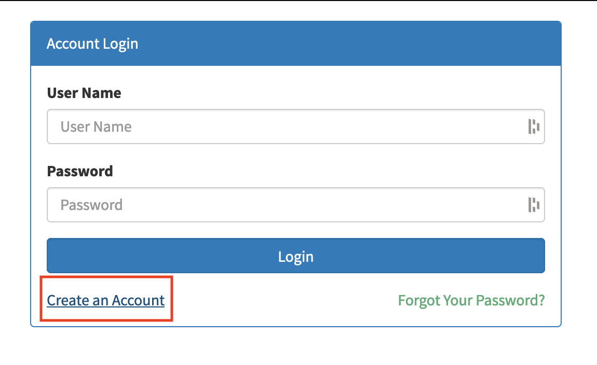

This instance is running locally, so feel free to
populate the form with dummy values: 

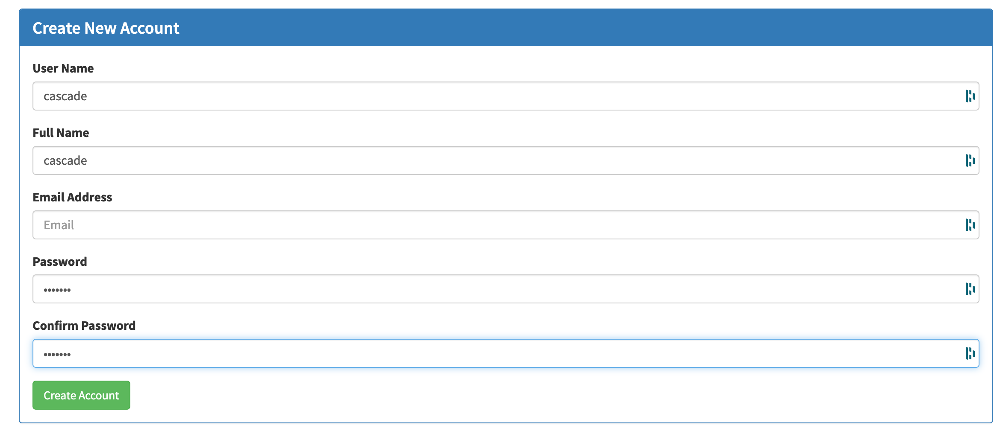


Next, use your new credentials, to log into the account.

## Configuring Cascade

The next step is to configure Cascade to be able to query the
BRAWL data stored in the Elasticsearch container.

First, select the 'Manage External Databases' option from the
User account drop-down menu:

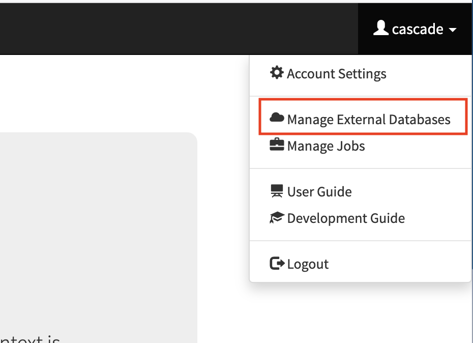

Next, click the 'Connect to Database' link.

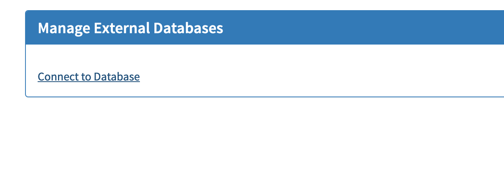

Add the following values in the form to tell Cascade how to
reach Elasticsearch:

- Name: "es"
- Platform: "ElasticSearch"
- Hosts: "elasticsearch,"
- Port: 9200
- use_ssl: unchecked
- verify_certs: unchecked

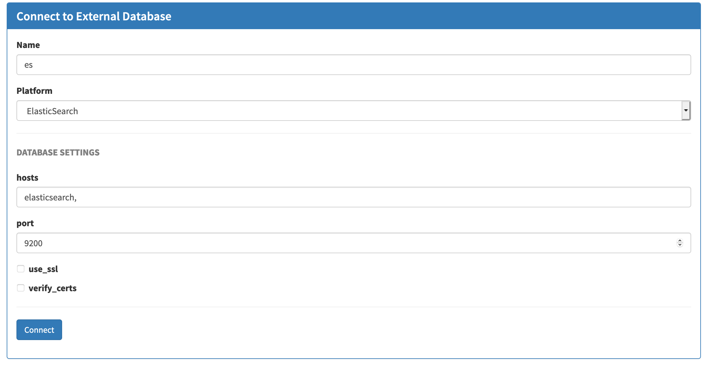

These external data sources are global in scope and 
one additional step must be taken to activate them for your
account:

Navigate to the 'Account Settings' from the user account drop-down.

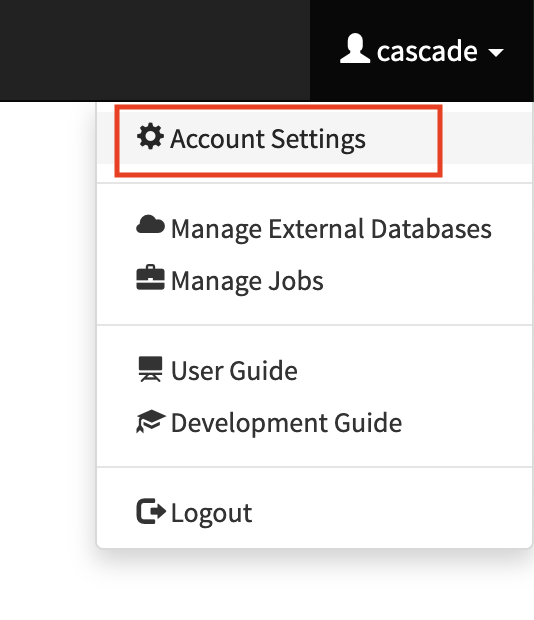

Select the 'Connect to Database' link, and the "es" 
option that we created earlier. Leave both the User Name 
and Password field blank (authentication is not required to access
the sample BRAWL data)

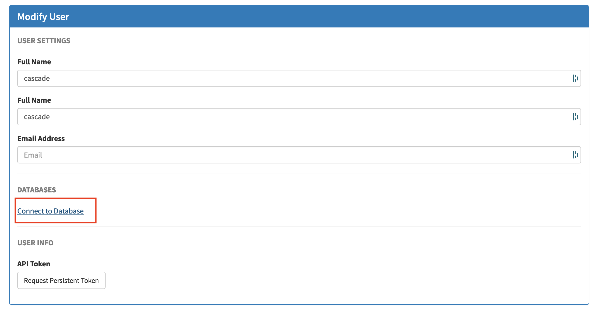
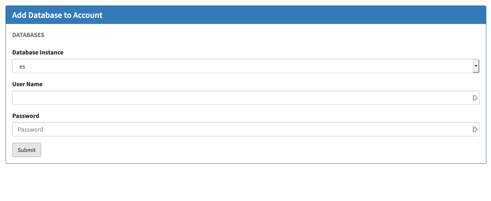

Click submit.

## Creating a Session

A Cascade 'Session' is a time window over which to run
queries to detect suspicious behavior.

We need to create a new session that covers the time
window during which the BRAWL game took place.

From the 'Sessions' menu, select 'Create New Session'.


Create a 'brawlgame' session with a date range that includes
the game (going back to 2013 as shown is definitely sufficient!)

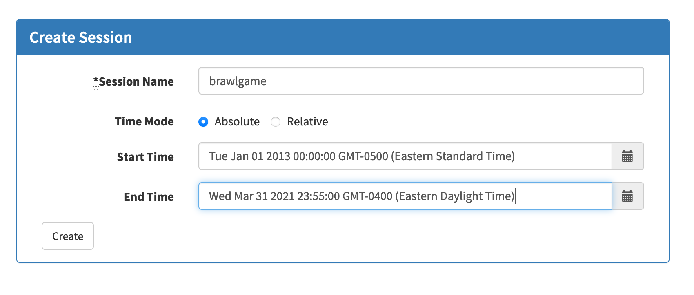

Click create.

## Running First-Pass Analytics

Now that we've configured Cascade with a data source and
a time window to query over, we can start hunting!

From the new 'brawlgame' Session menu, select 'Run Analytics'

**Gotcha 1**: If this session isn't immediately available after 
clicking create, try refreshing the page once.

**Gotcha 2**: If you're using an ad-blocker browser extension, 
some views may not work for you. This isn't because 
Cascade is trying to track you!  The web app uses a backend
HTTP API endpoint `api/analytics`. Just the word "analytics"
actually matches some broad patterns in some ad-blocking extensions. The
request is only reaching out to the local cascade-server 
running in Docker and is a false-positive. 
Feel free to open your browser's dev tools
to inspect the request and verify this for yourself before
disabling your ad-blocker.

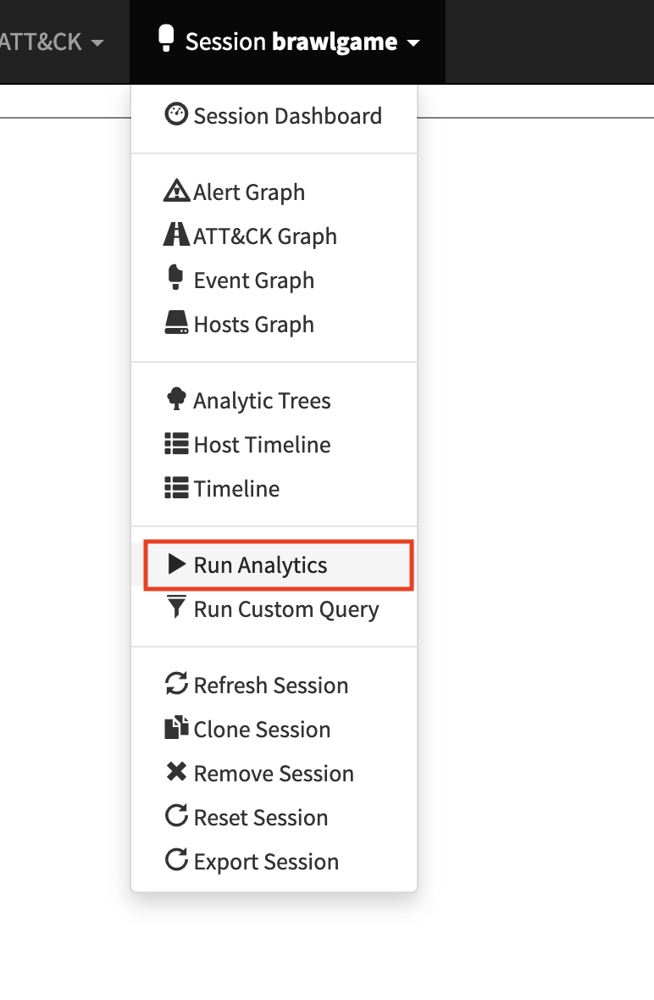

By default, Cascade will run a lot of queries.
Here, we can be much more fine-grained: 
Click the 'Clear All' button to deselect everything,
then only select the 
`Analytic - Copy Into Network Share (via "cmd /c...`
analytic and make sure it's set to run in 'First Pass' Mode.
Then, click 'Run Analytics.'

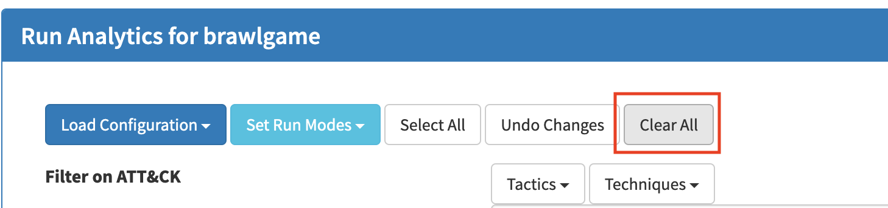
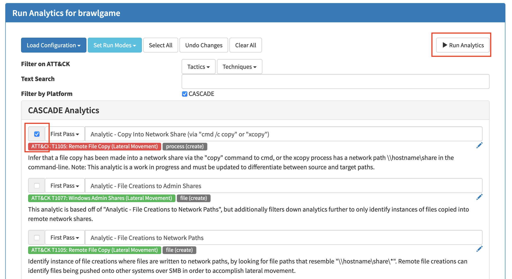

This will fetch a bunch of data from Elasticsearch.
Initially the direct matches are pulled in and added
to Cascade, however 'First Pass' mode will continue 
pulling in several related events, effectively building
process trees and (in this case) tracking lateral movements
accross hosts in the Brawl environment.

Wait for the progress bar to complete, and refresh the page.

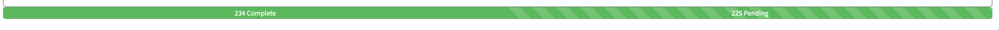

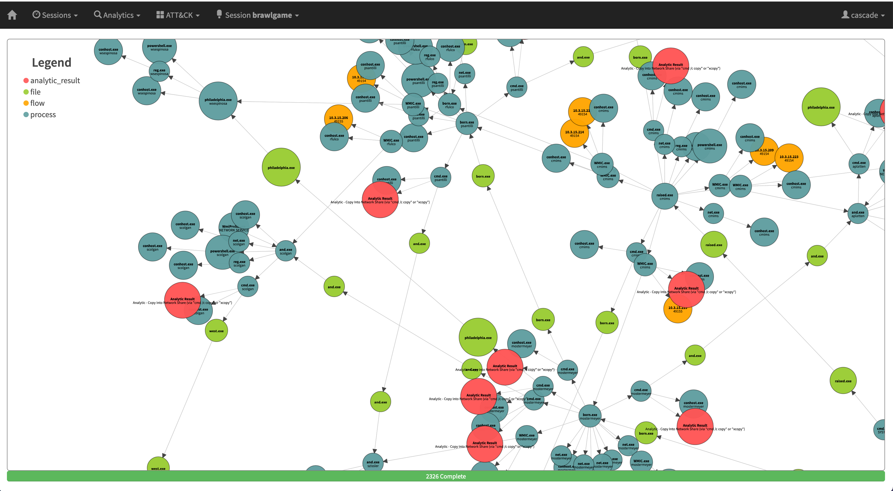

This has pulled in a lot of interesting information! In this 
Brawl game, Caldera only employed one lateral movement technique,
and the First Pass analytic we used was able to find all of these
executions.  These initial hits served as a threads to pull on 
to unravel pretty much all the interesting events in the data 
set (things are rarely this easy with real data).

## Running Second-Pass Analytics

While the previous step, pulled in lots of interesting
events, we can further enrich them by running 'Second Pass' queries.
While 'First Pass' queries originate their investigation by
searching over external data, 'Second Pass' queries look at
the events that have already been retrieved into a Cascade 'Session'.
They can be useful in a couple ways: 

1) Tag the retrieved events with ATT&CK information which can inform
downstream analysis.
   
2) Select additional interesting events that should be fully investigated.

Go back to the 'Run Analytics' view this time select everything,
being sure to pick the 'Second-Pass' run mode.  We can get
away with running everything at once because this action will
only start out by looking for hits in the events already in the 
Session.

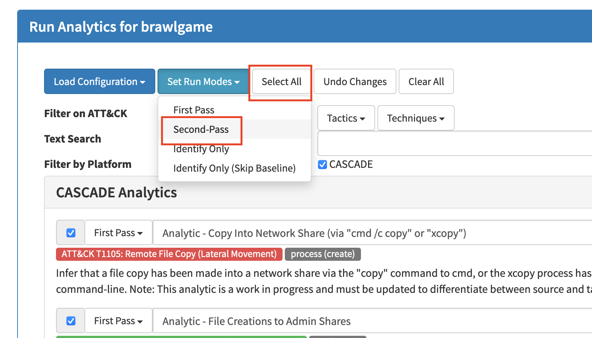

Wait for the queries to complete and refresh the page.

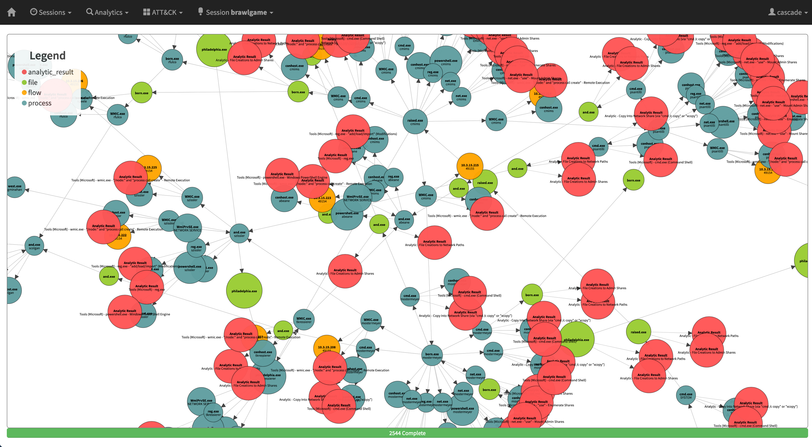

Note that the resulting event graph is very similar, however
there is a lot more ATT&CK and analysis information present
(the red bubbles).


## Check Out Different Views

As a last step, check out some other visualizations
that can be found under the Session menu. 

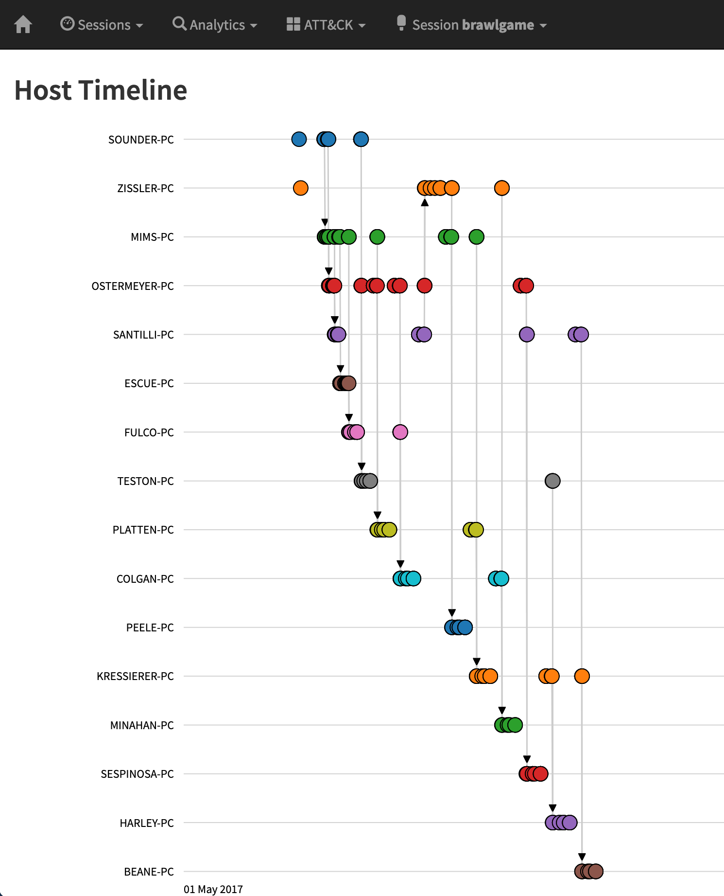

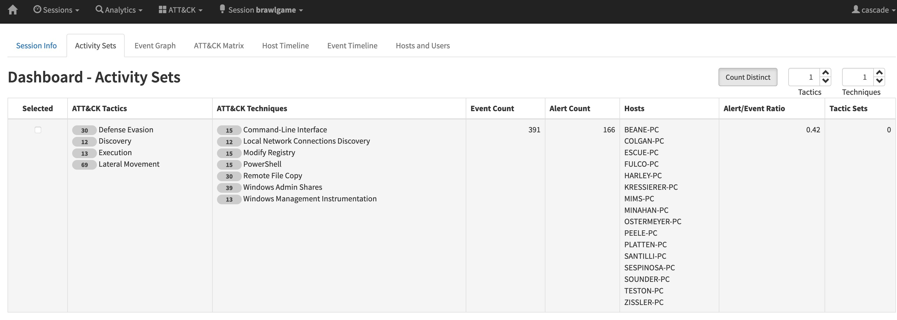


## Stopping and Resetting the Demo

To stop and reset the demo run: 

```shell
docker-compose down -v
```
